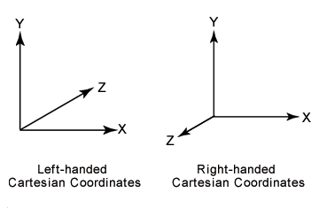

# Notes
## Mathematical notation and definitions
* _Vectors_ and _points_ are denoted by bold lowercase letters in **column vector format**
$$$v=\begin{pmatrix} v_x \\ v_y \\ v_z \end{pmatrix} = \begin{pmatrix} v_x & v_y & v_z \end{pmatrix}^T$$$
Using homogenous notation, a coordinate is represented by four values $$v=\begin{pmatrix} v_x & v_y & v_z & v_w\end{pmatrix}^T$$, where a vector is $$v=\begin{pmatrix} v_x & v_y & v_z & 0\end{pmatrix}^T$$ and a point is $$v=\begin{pmatrix} v_x & v_y & v_z & 1\end{pmatrix}^T$$
* _Matrices_ are denoted by bold upercase letters **M**. The scalar elements of a 3x3 matrix **M** are denoted $$m_{ij}, 0\le(i,j)\le2$$, where _i_ denotes the row and _j_ the column as in the following equation
$$$\bold{M}=\begin{pmatrix} m_{00} & m_{01} & m_{02} \\ m_{10} & m_{11} & m_{12} \\ m_{20} & m_{21} & m_{22} \end{pmatrix}$$$
The following notation is used to isolate vectors from the matrix **M**: $$m_{,j}$$ represents the *j*th column vector and $$m_{i,}$$ represents the *i*th row vector in column vector form
$$$\bold{M}=\begin{pmatrix} m_{,0} & m_{,1} & m_{,2} \end{pmatrix} = \begin{pmatrix} m_{x} & m_{y} & m_{z} \end{pmatrix} = \begin{pmatrix} m_{0,}^T \\ m_{1,}^T \\ m_{2,}^T \end{pmatrix}$$$
* A _plane_ is denoted $$\pi : n \cdot x + d = 0$$ and contains its mathematical formula, the plane normal **n** and the scalar _d_. The plane $$\pi$$ is said to divide the space into a _positive half-space_, where $$n \cdot x + d \gt 0$$, and a _negative half space_,  where $$n \cdot x + d \lt 0$$. All other points are said to lie in the plane
* A _triangle_ can be defined by three points $$v_0$$, $$v_1$$ and $$v_2$$ and is denoted by $$\triangle v_0v_1v_2$$
* _Clamping operators_ are defined as follow:
$$$ x^+=\begin{cases} x &\text{if } x \gt 0 \\ 0 &\text{otherwise}\end{cases}$$$
$$$ x^\mp=\begin{cases} 1 &\text{if } x \ge 1 \\ x &\text{if } 0 \lt x \lt 1 \\ 0 &\text{otherwise}\end{cases}$$$
* _Coordinate planes_ or _axis-aligned planes_ are the common planes $$x=0$$, $$y=0$$, $$z=0$$
* The _main axes_ or _main directions_ are the axes $$e_x=\begin{pmatrix}1 & 0 & 0\end{pmatrix}^T$$, $$e_y=\begin{pmatrix}0 & 1 & 0\end{pmatrix}^T$$ and $$e_z=\begin{pmatrix}0 & 0 & 1\end{pmatrix}^T$$ and are individually called the x-axis, y-axis and z-axis. These are often called the standard basis
* The two-value arctangent $$atan2(y,x)$$ is an extension of the mathematical function $$arctan(x)$$. The main differences between them are that $$-\frac x 2 \lt arctan(x) \lt \frac x 2$$, that $$0 \le arctan2(y,x) \le 2\pi$$, and that an extra argument has been added to the latter function to avoid division by zero when doing $$arctan(\frac y x)$$
* All across these notes $$log(n)$$ means the natural logarithm $$log_e(n)$$, not the base-10 logarithm $$log_{10}(n)$$
* We use a _right-hand coordinate system_

  

* _Colors_ are defined by a three-element vector, such as (red, green, blue), where each element has the range [0, 1]
* A _model_ or _object_ is a collection of geometric entities
* A _scene_ is a collection of models comprising all the things that is included in the environment to be rendered. It can also contain material descriptions, lighting, and viewing specifications
* _Shading_ and _shader_ terms are used to refer computer-generated visual appearance ("shading model", "shading equation", ...) or a programmable component of a rendering system ("vertex shader", "fragment shader", ...)

## Modern OpenGL
* **ARB_texture_storage**: Introduced in OpenGL 4.2, introduces immutable textures whose metadata (e.g. how many MIP levels are required)
* **ARB_multi_draw_indirect**: Introduced in OpenGL 4.3, it's batching on steroids. It can render multiple different geometries in a single draw call
* **ARB_buffer_storage**: Introduced in OpenGL 4.4, it gives better usage hints than _glBufferData()_ and allows applications to pass additional information about the requested allocation. It also introduces persistent mapped buffers, which allow applications to retain mapped buffer pointers across multiple threads
* **ARB_enhanced_layout**: Also introduced in OpenGL 4.4, allows the use of compile-time constant expressions in layout qualifiers and specifying explicit byte offsets within a uniform or shader storage block
* **ARB_direct_state_access (DSA)**: Introduced in OpenGL 4.5, provides a set of API functions to manipulate OpenGL objects, such as textures and buffers, directly rather than by means of the classic _bind-to-edit_ approach. This allows one to modify an object state without affecting the global OpenGL state
* **GL_ARB_indirect_parameters**: Introduced in OpenGL 4.6, allows to store some parameters like draw count to MDI drawing commands inside buffers
* **GL_ARB_shader_draw_parameters**: Also introduced in OpenGL 4.6, adds new built-in variables to GLSL vertex shader inputs, *gl_BaseVertexARB*, *gl_BaseInstanceARB* and *gl_DrawID*
* **ARB_gl_spirv**: Allows a SPIR-V module to be used as a shader stage in OpenGL. This means we can use the GL shading language compiler to produce binary modules consumable by OpenGL and Vulkan
* **ARB_bindless_texture**: Allows using 64-bit handles instead of texture objexts

All these extensions are considered to be part of the __Aproaching Zero Driver Overhead (AZDO)__ set of techniques to make OpenGL faster by batching a lot of draw calls together

# Projects

# Resources

# References
* Real-Time Rendering (4th. ed.) - Tomas Akenine-Moller, Eric Haines, and Naty Hoffman. 2018. A. K. Peters, Ltd., USA.
## Links
### Repositories
* 

### Readings
* 

## Books to read
* 

## Websites
* [realtimerendering.com](https://realtimerendering.com)